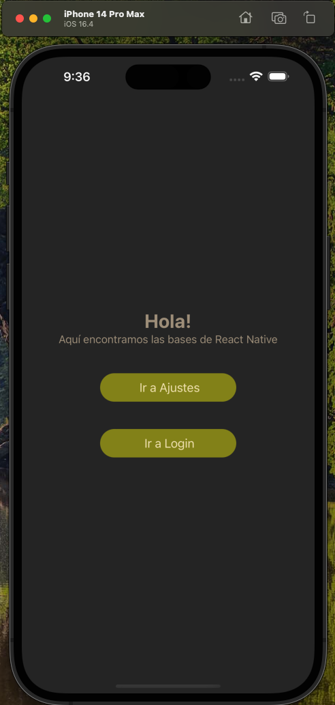
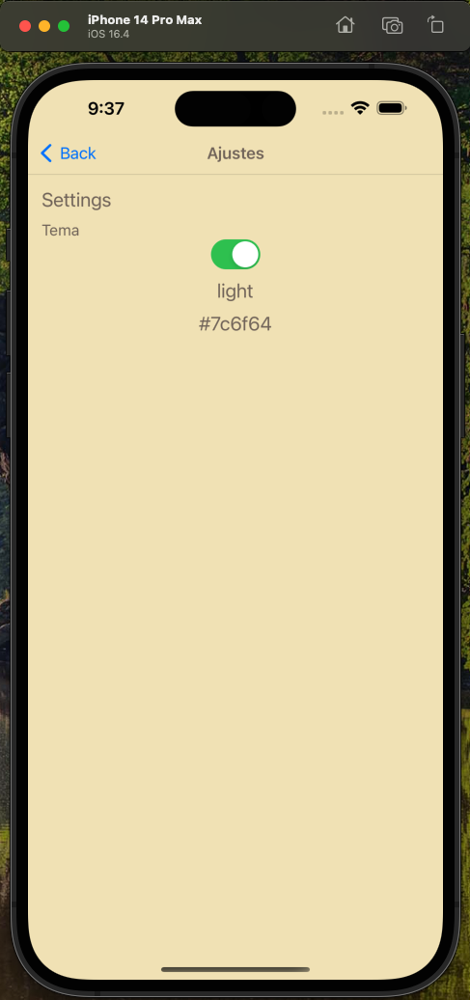
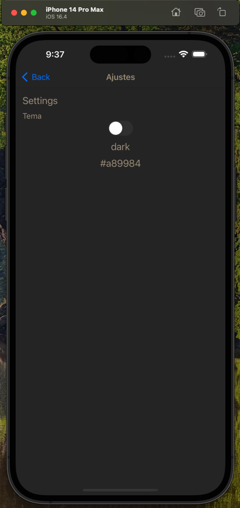
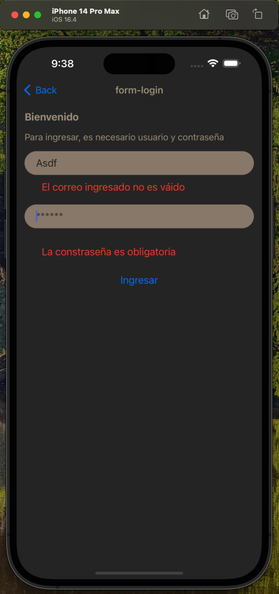

# TecAbel's react-native basics example
Simple basics react native app

## Home
<p align="center">
  
</p>

## Light and dark theme
<p>
  
  
</p>

## Form usage
<p align="center">
  
</p>

### To run
Install all dependencies with yarn

```shell
yarn install
```

Run de proyect

```shell
yarn run
```
